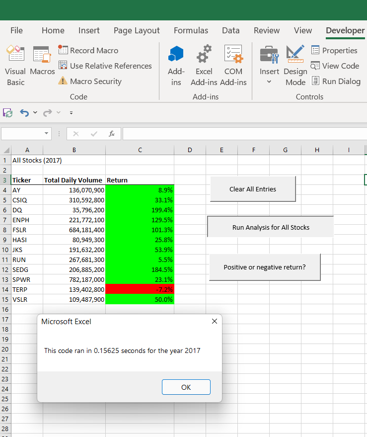
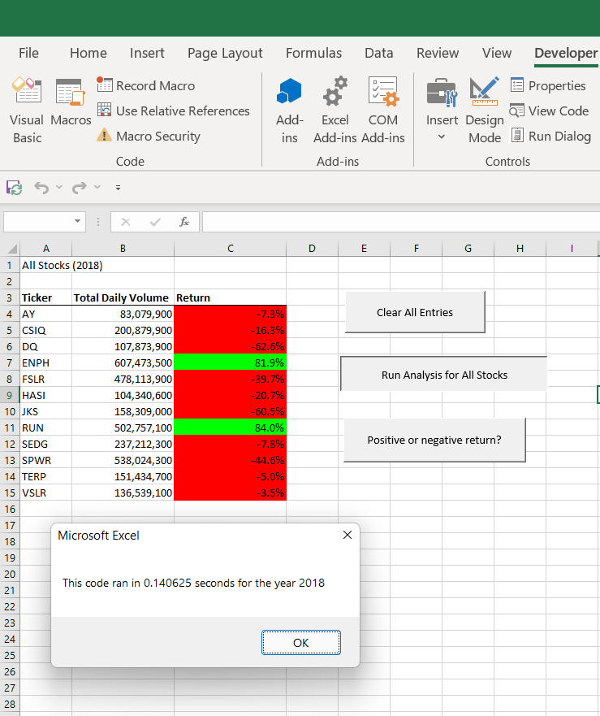
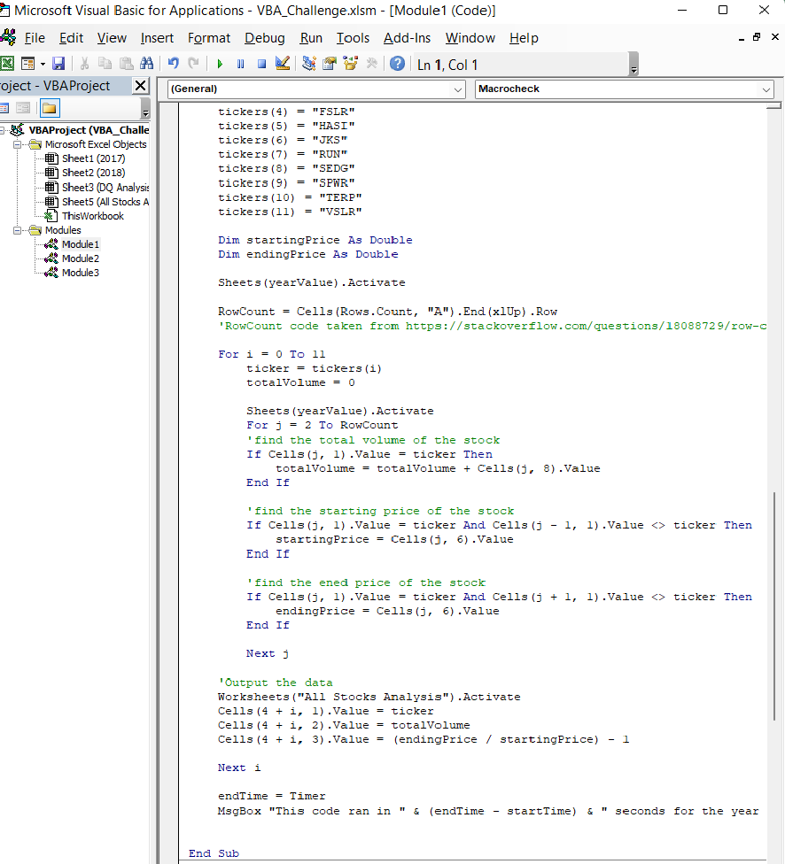
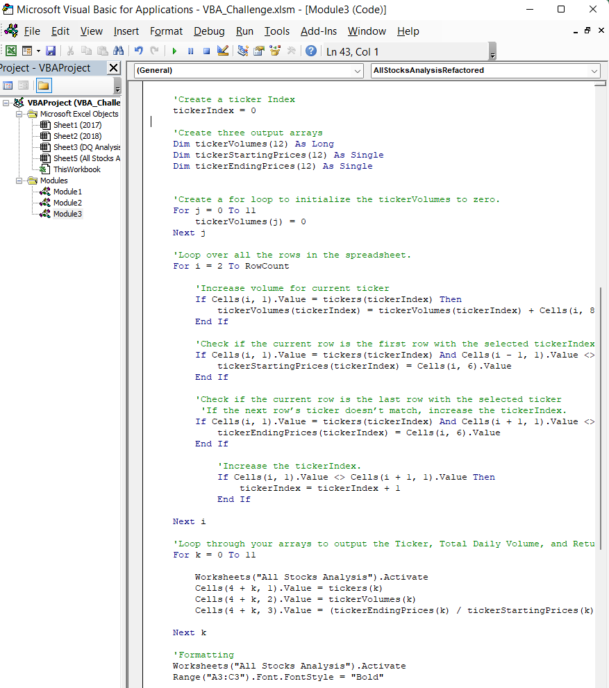

# An Analysis of Green Energy Stocks
## Overview of the Project
There are many different forms of green energy such as hydro, geothermal, wind and bio.  In order to determine which forms of green energy are good investments, twelve different green energy stocks were analyzed over a period of two years.  The total volume and change in starting prices of the stocks were examined over years 2017 and 2018.  Code in VBA was created to perform this analysis and was refactored in order to lower the time needed to perform the calculations.  A summary of the stock performance and the results of refactoring the code are given in the sections that follow.   

## Results
### Green Stock Performance
#### 2017
As can be seen in the image below, eleven of the twelve green energy stocks had positive returns in 2017.  The three stocks with the best returns included DAQO New Energy Corp (DQ), Enphase Energy (ENPH) and Solar Edge Technologies (SEDG).  All of the stocks listed have total daily volumes above the 25 million criteria used to determine if a stock is a more reliable investment.  However, it should be noted that DQ's total daily volume is just barely above this criterion, being traded several times less than the other green stocks. Also, of note is that while SunRun Inc. (RUN) only had a modest return of 5.5%, it had one of largest total daily volumes of 267 million.  

#### 2018
As can be seen in the image below, only two of the twelve green energy stocks had positive returns in 2018.  The two stocks that performed well, with over 80% returns, included Enphase Energy and SunRun Inc.  Additionally, both of these stocks had total daily volumes in the hundreds of millions, indicating they are a less risky investment option.  For two years straight, Enphase Energy and SunRun Inc. have have positive returns and large total daily volumes.  All other stocks, including DAQO New Energy Corp, had negative returns for 2018.     

### Code and Execution Times
#### Original Code
Stock data for the twelve green energy companies was imported into EXCEL and then VBA code was created to analyze the data. This code cycles through the data looking for each of the twelve sticker codes individually.  When there is a match to the sticker code, it adds up the total daily volume and also determines the starting and ending price of the stock for the year.  A screen shot of the code below, shows that all the stock data is filtered through 12 times (starting with "for i = 0 to 11"). Hence, for each run through only about 1 in 12 or 8.3% of the data is being utilized.  While the data outcomes are correct, it is an inefficient way to make calculations.  The time to execute the code for both the 2017 and 2018 data was aroudn 0.75 s.    

#### Refactored Code
In order to make the code more efficient, arrays were created to hold total daily volume, starting price and ending price of the green stocks.  The screenshot below shows how the arrays were created and how this time the data for the green stocks is only run filtered one time (starting with "for i = 2 to RowCount").  Each row of the EXCEL data is checked to see which stock the information pertains to and then is placed into a corresponding array.  Because the data is only run through one time, as opposed to twelve times in the original code, the execution time is only about 0.15 s.  This execution time is six times less than the original code.  Examples of the code execution time can be seen in the EXCEL data file screenshots above.     

## Summary
### Advantages and Disadvantages of Refactored Code
There are many reasons one may wish to refactor code.  The design of the original code may be inefficient or may not be easily expandable.  Additionally, refactoring software can make it easier to understand, especially if one intends to use the code long term or has several different programmers using the code.  Well-written, refactored code may also help one to find bugs in the original code that were not apparent before.  By refactoring code, one can make it faster, more efficient, and more adaptable.  

The disadvantages of refactoring code are twofold.  First, nothing new is being created when refactoring.  Hence, you are creating code to solve a problem that has already been solved.  Second, the time commitment to refactor code can be large.  A new design must be created, coded, tested and debugged, without a guarantee that the end product will be better than the initial product.  If a coding project has time constraints, it may not be feasible to refactor it.    

### Application to Current VBA Code
The original VBA code used to analzye green stocks was refactored.  By utilizing arrays, the time to execute was lowered from 0.75 s to 0.15 s.  Hence, the refactoring did lower the excecution time significantly as expected.  The arrays in the refactored code have the advantage of being easily expanded to accompany more than the twelve stocks reviewed in this project.  Hence, the new code is more adaptable than the original code.  Future projects could easily add more green stocks to be analyzed with minimal coding changes.  

The downside to creating the refactored code was that an additional day was needed to create code that ultimately produced identical results as the original.  Additionally, the output time saved was negligible in the frame of reference of the end user.  To the end user, 0.75 s and 0.15 s feels the same.  

 

